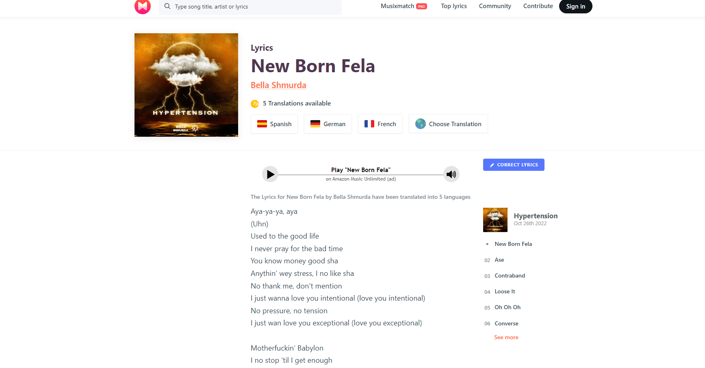

# Lyric Ocean
Get your music deep

(Created by Group 7 "RED-co-DER" : Iryna Lototska, Salisu Isah, Swetha Nagaraja)

## Description
The React application, which will help user to search song lyrics. This music app also show top-10 tracks.

## User Story
As a music lover, I want to see TOP-10 songs on the main page and to have option to read lyrics. I want to be able search song lyrics by writting a song title or artist name. 

  ### Table of Contents
- [Installation](#installation)
- [Structure](#structure)
- [Netlify](#netlify)
- [GitHub](#github)
- [Technologies](#technologies)
- [License](#license)

## Installation
1. Pull code from Github repository.
2. Run "npm install" to install dependencies.
3. Run "npm start" to start the development server.
4. Open http://localhost:3000 to view the app in the browser.

### Structure
The webpage includes a navigation bar: Home, Search, Contact:
- Home : will show top-10 songs.
- Search : for searching lyrics.
- Contacts : to contact with owners (for questions or commercial proposals).

<< App Screenshots >>

## Netlify -
The app is deployed on Netlify and can be accessed at – 

[https://lyricalocean.netlify.app/](https://lyricalocean.netlify.app/) 

## GitHub -

The app is deployed on Github and can be accessed at –

[https://github.com/isahsalisu/LyricOcean](https://github.com/isahsalisu/LyricOcean) 

## Technologies 

* The Musixmatch API
* React
* Node.js
* HTML
* CSS 
* JavaScript
* React Bootstrap

## License
MIT License

